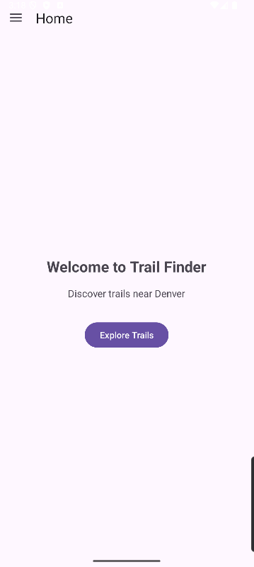
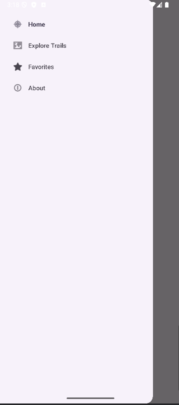
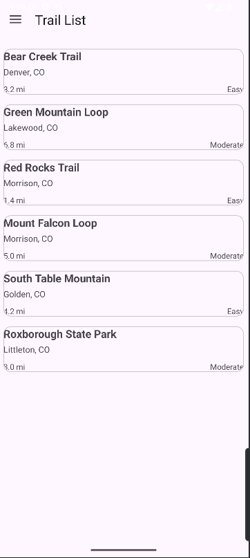
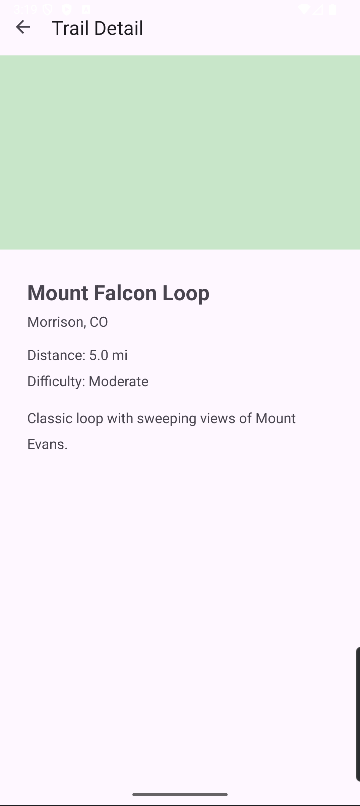

# TrailFinder

  
  
  
  

## What the app does
TrailFinder is an Android app for viewing hiking trails. Users can open the trail list, scroll through available trails, and tap one to see its details. The app also includes a navigation drawer that lets users move between Home, Explore Trails, Favorites, and About.

## What I built
I built TrailFinder as a multi-screen Android app using fragments and Jetpack navigation tools. The app uses a Navigation Component with a nav graph to define the screens and how they connect. I created HomeFragment, TrailListFragment, and TrailDetailFragment as the main parts of the app, and later added FavoritesFragment and AboutFragment as additional top-level destinations for the drawer menu.

I created a Trail data class to represent each trail as a real object with properties like id, name, location, distance, difficulty, and description. I also built a TrailViewModel to store the list of trails and keep that data available across configuration changes like screen rotation. The ViewModel exposes the trail list through LiveData, which allows the UI to observe changes instead of directly owning the data.

For the list screen, I replaced hardcoded buttons with a RecyclerView so the app could scale to more trail items. I created an item_trail.xml layout for each row and a TrailAdapter to bind trail data into the RecyclerView cards and handle clicks. I then used Safe Args so that when a user taps a trail, the selected `trailId` is passed safely from the list fragment to the detail fragment. This allowed the detail screen to show the correct trail instead of always showing the same placeholder item.

Finally, I added drawer navigation using DrawerLayout, NavigationView, MaterialToolbar, and NavigationUI. This made it possible to jump directly between top-level destinations and automatically update the toolbar title and hamburger/back behavior.

## Honest reflection
This project helped me understand how Android app structure becomes much cleaner when data, UI, and navigation are separated. At the beginning, the app worked with hardcoded buttons, but it was very limited and did not scale well. Once I moved the trail data into a ViewModel and then into a RecyclerView, the app felt much more like a real application instead of just a basic demo. The most frustrating part was definitely setting up Safe Args because the Gradle configuration caused problems that were not obvious at first. That part taught me that small version mismatches can break features in ways that are hard to trace. Even though that was frustrating, I think it was useful because it forced me to pay closer attention to how the project files connect. Overall, this project made me more comfortable with fragments, adapters, generated navigation code, and the way multiple Jetpack components work together in one app.